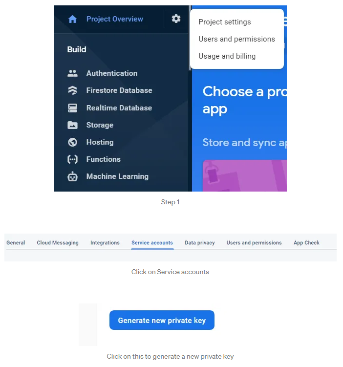

# Python-Firestore-Connection
This is a code for the connection with python and firestore.

1. Add the Firebase Admin SDK to your Python app:
    
    pip install --upgrade firebase-admin

2. Follow the instructions below to initialize Cloud Firestore with the proper credentials in your environment.

3. secret key.json
    This secret key needs to be downloaded and will be available at Project Settings -> Service Accounts -> Generate a new private key

4. Initialize Cloud Firestore
    Initialize on Google Cloud

    import firebase_admin
    from firebase_admin import firestore

    app = firebase_admin.initialize_app()
    db = firestore.client()
